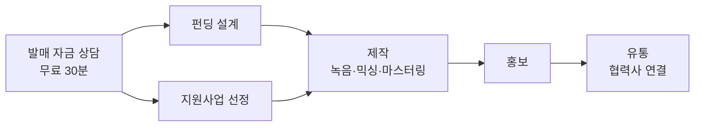

# 스튜디오 놀 매출 증대 전략 제안 (2026-09)

Sep 25, 2026 · @황경하

## 결론

12개월 목표는 월 매출 +300~400만원(발매 파이프라인이 분기 2건이면 +440만원 안팎)이다. 초안의 600~900만원은 운영자 1인의 과금 가능 시간(월 100~110시간)을 무시한 약 2배 과대 추정이었다.

중심은 **펀딩으로 제작비를 만들고 제작·홍보·유통까지 한 팀이 끝까지 가는 발매 파이프라인**이다. 이미 잘하고 있고, 같은 일을 한 곳에서 하는 경쟁자가 없다. 그 위에 매달 60건 넘게 오는 리드의 성사율, 연습실 만실, 지원사업 선정자 제작이 기반을 만든다. 광고·오디오북·셀프녹음은 상단을 여는 선택지다.

크몽·숨고는 만들지 않는다. 모든 문의와 대응은 사이트+카카오톡+전화로 집중한다. 그 자리의 검색 수요는 네이버 유료검색과 플레이스로 사이트에 끌어온다.

**첫 번째 지표는 매출이 아니라 "리드 → 결제율"이다.** 지금은 카톡 클릭만 세고 성사는 세지 않는다. 4주 실측 뒤 11월에 목표를 다시 정한다. 실제 매출 장부는 이번 분석에서 열지 못했고, 현재 서비스 매출은 월 300~400만원으로 가정했다.

## 회의 경과: 초안에서 바뀐 것

패널 5인(전환, 수요 유입, 재무·운영, 고객 대변, 지원사업·B2B)이 각자 조사했고, 의장 역할의 반대 검토가 종합안을 한 번 더 공격했다. 가장 큰 변화는 아래와 같다.

| 초안 | 수정 | 이유 |
| --- | --- | --- |
| 월 +600~900만 | 월 +250~400만 | 과금 가능 시간 월 100~110h. 비과금 응대·견적·콘텐츠가 월 75h |
| 지원사업 "신청 패키지" 판매 | 선정된 돈의 제작처(공급자)가 된다 | 신청 도움은 시간당 5만에 묶이고 이해충돌·부정수급 위험. 제작비는 건당 200~800만 |
| 발매 번들·홍보 중심 | 시간당 공헌이익 순 배분 | 번들은 시간당 0.2~2.1만, 홍보 도입가는 0.7만으로 최저임금 미만 |
| 크몽·숨고 프로필 | 사이트 견적 요청서·후기·결제 + 네이버 유료검색 | 운영자 결정. 그 자리의 검색 수요는 네이버 유료검색과 플레이스로 사이트에 끌어온다 |
| 셀프녹음 부스 즉시 | 2027년 2분기 이후로 미룸 | 엔지니어 세션 잠식, 무인 출입·파손·보험이 새로 필요 |
| 축가 영상 45만 | 35만 유지, 샘플·후기 먼저 | 경쟁가 12~30만인데 들을 수 있는 샘플이 0개 |
| 리뷰 요청 습관화 | 8주 뒤 자동화 | 세 번 제안됐고 한 번도 실행되지 않았다 |
| 없음 | 오디오북(출판사 B2B) 추가 | 공공 지원 규격이 스튜디오 매출 항목과 일치, AI 음성 불가 |

패널이 찾은 **사실 두 가지**도 있다. 펀딩 설계 대행 페이지와 연습실 시간제 안내를 포함한 13개 커밋이 main에 머지되지 않아 운영 사이트에서 404다. 카카오톡 링크는 채널이 아니라 오픈프로필이라 자동응답을 쓸 수 없다.

## 핵심 축. 제작비부터 만들어 발매까지 한 팀이 간다

펀딩 기획으로 제작비를 만들고, 녹음·믹싱·마스터링과 홍보를 하고, 협력 유통사를 연결해 발매까지 끝내는 것이 스튜디오 놀의 가장 큰 강점이다. 공개로 검증되는 펀딩 성공이 19건이고, 최근 음반 펀딩 7건의 모금액은 300만~1,611만원, 중앙값 약 810만원이다. EP 번들 180만원에 리워드 제작비를 더해도 그 안에 들어간다. 그런데 사이트는 이 흐름을 부가 서비스 목록에 흩어 놓았다.

펀딩과 지원사업은 자금원만 다르고, 제작부터는 같은 흐름을 탄다.

| 단계 | 스튜디오가 하는 일 | 매출 | 운영자 시간(가정) |
| --- | --- | --- | --- |
| 상담 | 펀딩·지원사업·자비 중 맞는 길 | 무료 | 0.5h |
| 펀딩 설계 | 스토리·리워드·페이지 | 설계비 50만(부가세 별도) + 플랫폼 수수료 5.5%(810만이면 약 45만). 성공 수수료 없음 | 40h |
| 제작·홍보 | EP 번들: 기획·녹음·믹싱·마스터링·국내외 홍보 | 180만(세션·아트워크 실비 별도) | 85h |
| 유통 | 협력 유통사 연결 | — | 1~2h |
| 합계 | 3~6개월 | 약 275만 | 약 125h(월 25~30h) |

**시간당으로는 약 2.2만원이라 녹음 세션보다 낮다. 그래도 핵심 축인 이유는 세 가지다.**

1. 돈이 후원자와 기금에서 나온다. 연 활동수입 901만원인 고객의 가장 큰 반론인 "비용"이 사라진다.
2. 결과물이 사례가 된다. 펀딩 페이지·발매작·홍보 리포트가 다음 고객을 설득하는 증거가 된다.
3. 한 고객이 3~6개월 머물고, 다음 음반에서 돌아온다.

**시간당 가치를 올리고 약점을 메우는 방법**

- **파이프라인 전체를 하나의 견적으로 낸다.** 펀딩이 성공하면 제작비를 모금액에서 집행하는 구조로, 단계별 추가 할인은 하지 않는다.
- **세션 연주비는 번들에 넣지 않고 연주자 실비만 받는다(섭외 수수료 없음, 2026-09-26 운영자 결정).** 스튜디오가 떠안으면 번들이 적자가 된다. 아트워크도 비용 별도다.
- **성공 수수료는 받지 않고, 목표액 계산기를 공개한다.** 구조는 설계비 50만원(부가세 별도)과 스튜디오 놀 펀딩의 플랫폼 5.5%·결제 3.3%(부가세 포함)뿐이다. 목표액 계산기는 이 수수료와 원천징수까지 넣어 거꾸로 계산한다. 소형 펀딩도 따로 취급하지 않고 같은 흐름으로 간다.
- **홍보는 국내와 해외를 모두 번들에 넣는다(2026-09-26 운영자 결정).** 국내 음악 매체·평론가와 해외 매체·라디오·플레이리스트 피칭이 싱글·EP·정규 번들에 기본으로 들어가고, 별도 옵션으로 떼지 않는다. 사이트의 번들 구성 문구가 이미 이렇게 약속하고 있어 일관성을 지킨다.
- **유통은 협력사 연결이라 운영자 시간이 거의 들지 않는다.** 이 사실을 페이지에 명시해 "유통까지 책임진다"를 보여준다.
- **신뢰 숫자를 맞춘다.** 배지 "누적 약 3억원"과 공개 표의 검증 합계(약 1.35억원)를 다른 이름으로 부른다. 전체 실적은 "누적", 공개로 확인되는 성공 건은 "합계"다. 운영자 결정에 따라 미달 건과 성공률 숫자는 싣지 않는다.
- **펀딩은 스튜디오 놀 펀딩에서만 연다.** 후원자·리워드·정산이 사이트에 남고, 플랫폼 수수료도 스튜디오 매출이 된다. 과거 텀블벅 건은 실적 표기에만 남긴다.

**사이트에서 할 일**

- 발매 프로젝트 첫 화면을 "제작비부터 만들어 드립니다"로 바꾸고, 무료 30분 발매 자금 상담을 단일 CTA로 둔다.
- 머지 대기 중인 펀딩 설계 페이지를 공개하고 발매 페이지와 서로 잇는다.
- 마리코 & 유키에 《남산타워》 사례 한 편을 만든다. 펀딩 → 녹음 → 홍보 → 유통 → 결과를 실제 수치로 보여준다.

목표 물량은 분기 1건, 여력이 있으면 2건이다. 동시에 두 건을 돌리면 운영자 시간 월 50~60h를 쓰므로 그 이상은 받지 않는다.

## 진단: 시간이 병목이고, 비쌀수록 시간당으로는 싸다

녹음·성우·마스터링이 시간당 6.5만원 이상으로 가장 낫고, 발매 번들과 홍보 도입가가 가장 낮다. 투입 시간은 준비·소통·수정을 포함한 가정이고, 카드수수료 3%를 뺀다.

| 상품 | 가격 | 운영자 시간 | 시간당 공헌이익 | 월 수요 상한 |
| --- | --- | --- | --- | --- |
| 시간당 녹음 2~4h | 20~40만 | 3~5h | 6.5~7.8만 | 5~8건 |
| 마스터링 | 10만/곡 | 1.5h | 6.5만 | 4~10곡 |
| 레슨 1:1 | 35만/월 | 5h | 6.8만 | 3~5명 |
| 성우 2h | 20만 | 3h | 6.5만 | 2~4건 |
| 축가 | 35만 | 7h | 4.9만 | 2~4건 |
| 보컬 1곡 | 25만 | 5h | 4.8만 | 3~6건 |
| 믹싱 | 20/35/50만 | 5.5/11/14h | 3.1~3.5만 | 4~8곡 |
| 펀딩 설계 + 플랫폼 수수료 (모금 500만~1,000만) | 약 78~105만 | 40h | 1.9~2.6만 | 연 4~6건 |
| 싱글 번들 | 50만 | 35h | 1.4만 (세션비 부담 시 0.2만) | 월 1건 |
| 음원 홍보 도입가 | 30만 | 43h | 0.7만 | 월 3팀 |

**세션비 표기가 엇갈렸다(2026-09-26 정리).** 발매 페이지 문구는 "세션 1~2인 포함"이라고 했는데 가격 정본에는 세션 항목이 없었다. 서울 세션은 곡당 인당 20~30만원이라 스튜디오가 떠안으면 번들은 적자에 가깝다. 운영자 결정으로 전 페이지를 "세션 연주비는 실비 별도, 섭외 수수료 없음"으로 맞췄다.

**고객은 귀로 판단하는데 들을 게 없다.** 녹음·믹싱·축가·성우·발매 페이지와 홈에 오디오가 0개다. 파도뮤직은 축가 12~16만원에 샘플 영상과 네이버 리뷰를 내세우는데, 우리는 35만원에 샘플 0개, 방문자 리뷰 0건이다.

**시장 배경은 그대로다.** 음악 분야 예술인 연 활동수입 평균 901만원, 인디 1순위 애로는 유통·홍보, 2027 대중음악 예산 802억(+38.5%), 서울 혼인 2026 상반기 +10.9%, AI 곡이 신규 업로드의 34~44%다.

## 지금 바로 할 5가지

매출에 가장 빨리 닿는 순서다. 합쳐 약 25~30시간이고, 나머지는 이것이 끝난 뒤다.

1. **연습실 빈방 1개를 채운다 (1~2h).** 펀딩 설계 페이지와 시간제 예약은 9/25에 머지·배포됐다. 빈방은 대기자에게 직접 연락해 채운다. 이것만으로 월 +36만원이다.
2. **이미 오는 리드의 성사율을 잰다 (주 2h).** 오늘부터 스프레드시트로 문의 → 견적 → 결제를 적는다(로컬 보관, 저장소 커밋 금지). 카톡으로 잡은 일정도 사이트 예약 결제 링크로만 확정한다.
3. **지원사업 제작처 페이지와 견적서 PDF를 10월 초까지 올린다 (12~16h).** 신청자는 지금 견적서를 붙이고, 그게 1~2월 선정 뒤 매출이 된다. 건당 200~800만원.
4. **최근 고객 15명에게 후기를 직접 요청한다 (3h).** 네이버 영수증 리뷰와 구글 리뷰 링크를 보낸다. 방문자 리뷰 0건은 광고와 플레이스 전환 전체의 병목이다.
5. **네이버 파워링크를 축가에만 건다 (셋업 4h, 월 10~21만원).** 토스 예약이 붙어 있어 클릭이 바로 결제로 이어진다. 집행 전 키워드도구로 CPC를 확인한다. **성우 LP는 2026-11-11까지 CTR 실험 중(🔒)이라 유료 트래픽을 태우면 실험이 무효가 된다 — 11/11 판정 뒤에 추가한다.** 연습실 LP·`recording-price1`도 10/13까지 같은 이유로 제외.

## 축 A. 사이트가 마켓플레이스를 대신한다

고객이 크몽·숨고에서 얻는 네 가지를 사이트가 직접 준다. 한국어 문의 폼은 90일간 0건이고 카톡은 87건이라, 새 장치는 카톡과 경쟁하지 않고 카톡 앞단에 붙는다.

| 마켓이 하던 일 | 사이트의 대체 | 지금 상태 | 시기 |
| --- | --- | --- | --- |
| 요청서·즉시 견적 | 견적 요청서: 4~5문항 → 가격 범위 즉시 표시 → 요약과 NOL 코드를 복사해 카톡 열기 | 문의 폼은 이름·연락처·메시지뿐 | 12주 이후, 시트로 성사율을 본 뒤 |
| 가격 비교 안심 | 발매·pricing에 "시장 평균 vs 우리 포함 범위" 표 | 없음 | 3~6주 |
| 결제 보호 | 환불 규정이 붙은 온라인 결제 확대. 우선 Day Lock 하나 | 녹음·성우·축가·커버·연습실·믹싱·마스터링은 있음 | 3~6주 |
| 후기 | 결제 기록과 연결된 후기 자동 요청(세션 다음 날, 믹싱 납품 뒤) + 네이버·구글 링크 | 사이트 후기 4건, 2025-01 이후 멈춤 | 수동 지금, 자동화 8주 뒤 |

나머지 세 가지:

- **들리는 증거를 LP마다 붙인다.** 믹싱 비포·애프터 30초, 축가 보정 전후, 성우 장르별 샘플 3개. 곡 저작권자와 실연자 동의가 모두 필요하다.
- **카카오 오픈프로필을 카카오톡 채널로 바꾼다.** 가격·위치·주차·환불·공실 키워드 자동응답과 운영시간 외 부재 메시지를 켜고, 답변은 하루 2~3번 몰아서 한다. **10월 14일 이후에** 한다. 10월 13일 판정하는 실험 3건이 카톡 클릭으로 리드를 세기 때문이다. 이벤트명은 그대로 두고, 오픈프로필은 닫지 말고 채널 안내로 남긴다.
- **스페이스클라우드·네이버 예약은 "발견 채널"로 둔다.** 응대가 앱 안에서 끝나 사이트 집중 원칙과 충돌하지 않는다. 다만 그 고객을 자체 결제로 유도하면 플랫폼 우회 결제라 약관 위반 위험이 있다.

## 축 B. 서비스명 검색 수요를 사이트로

"축가 녹음", "성우 녹음실", "미디 레슨" 같은 서비스명 검색의 상단은 크몽·숨고가 차지하고, 우리 서비스 LP는 미노출이다. 그 자리는 유료검색과 로컬 신호로 대신한다. 파워링크·구글 광고는 한 번도 집행된 적이 없다.

| 채널 | 실행 | 월 비용 | 착지 | 판정 |
| --- | --- | --- | --- | --- |
| 네이버 파워링크 | 우선 축가 녹음 롱테일만. 성우 녹음실·나레이션은 성우 LP 실험 종료(11/11) 뒤. 합격하면 믹싱 의뢰·음원 발매 대행 추가 | 10~21만 | 축가 LP(예약 결제 있음) | 4주, 결제 기준 건당 비용 |
| 네이버 플레이스 광고 | 은평·서대문·마포·고양 반경, "녹음실"·"축가 녹음" | 6만 | 플레이스 → 사이트 예약 링크 | 플레이스 통계 + 리드 시트 |
| 네이버 예약 상품 분할 | 축가·성우 상품 추가(행동 신호가 플레이스 순위에 반영) | 0 | 플레이스 | 예약·전화·길찾기 클릭 |
| 구글 검색광고 | 믹싱 의뢰·온라인 믹싱, en "mixing service Korea" | 10만 | 믹싱 주문 | 파워링크 합격 뒤에만 |

- **착지 제약:** 10월 13일까지 연습실 LP와 recording-price1 등 판정 중인 페이지로 광고를 보내지 않는다. 유료 세션이 섞이면 판정이 오염된다.
- **축가 광고 문구는 가격이 아니라 차별점으로 쓴다.** 프리미엄 체인, 보정, 반나절 납품. 가격 문제와 채널 문제를 섞으면 무엇이 원인인지 가릴 수 없다.
- **당근은 비즈프로필 채팅을 열지 않는다.** 응대 채널이 늘기 때문이다. 광고를 한다면 착지는 사이트다.
- **숏폼은 채널이 아니라 LP 신뢰 소재다.** IG 팔로워 112, 90일 SNS 유입 리드 2건이다. 동의받은 세션마다 15초 완성본 1편을 만들어 LP에 싣는다.
- **모든 유료 채널은 UTM으로 분리하고**, 첫 응대에서 "어떻게 알고 오셨어요?"를 물어 리드 시트에 남긴다.

## 축 C. 이미 아는 사람들에게 다시 판다

획득 비용이 0인 고객이 이미 있다. 월 운영 2시간으로 월 1~2건을 기대한다.

- **연습실 입주자.** 이미 활동 중인 음악인이다. 할인이 아니라 녹음·믹싱 우선 예약권으로 교차판매한다. 대기자 응대에도 녹음·믹싱 안내 한 줄을 넣는다.
- **과거 고객과 펀딩 19건의 아티스트.** 분기 1회 "제작처·홍보·지원사업 시즌" 안내를 보낸다. 다음 음반을 준비하는 사람이 가장 가까운 고객이다.
- **한국스마트협동조합 조합원 약 580명.** 같은 은평구다. 가격 혜택 없이 "2027 지원사업 서류 세미나" 1회를 시간제 컨설팅으로 열고, 축 C의 서류 키트를 배포한다. 사이트 엔티티는 분리한 채로 둔다.
- **불광믹싱클럽.** 월 1회 정례화해 퍼널 최상단으로 쓴다. 코호트 레슨은 마켓플레이스라는 획득 경로가 없어졌으므로 이 모임과 조합 경유로만 모집한다.

## 가격 정비

가격은 정본 한 곳만 고치면 끝나는 일이 아니다. 7개 언어 문구와 스토리, 수치 검사가 딸려 오므로 효과가 큰 것부터 하나씩 바꾼다.

| 항목 | 제안 | 시기·조건 |
| --- | --- | --- |
| 연습실 시간제 | 4,400 → 5,500~6,600원(스페이스클라우드 동일가). 대조동 시세 6,500~7,500원 | 10월 13일 판정 뒤 |
| 컨설팅 | 5만 → 10만원/h, 계약하면 차감 | 즉시 가능 |
| Day Lock | 6h 50만은 보컬 1곡과 같은 단가라 할인 역할을 못 한다. 4h 35만 / 8h 65만으로 재편하고 온라인 예약에 추가 | 3~6주 |
| 녹음 최소 2시간 | 유지. "첫 1시간 15만"은 가장 흔한 단위를 25% 올리고 보컬 1곡과 충돌해서 기각 | — |
| 믹싱 수정 | 기본 2회는 유지하고 "추가 수정 5만원"만 신설 | 3~6주 |
| 발매 번들 | 세션 연주비는 실비만 별도(섭외 수수료 없음, 반영 완료). 싱글 65~70만 재가격 검토 | 가격은 성사율 본 뒤 |
| 축가 | 35만원 유지. 샘플·후기를 먼저 붙이고, 영상 포함안은 템플릿으로 편집 1시간 이하가 될 때만 | 샘플 확보 뒤 |
| 커버 영상 | 시간당 3.6만원. 고정카메라·원테이크로 편집을 줄이거나 45만원 | 검토 |
| 촬영 대관 | 10만/h는 시장가 1~4.4만의 3~10배. 단독 노출을 내리고 커버 영상에 흡수 | 검토 |
| 연습실 월세 | 36만원 유지. 연신내 경쟁 작업실이 20~30만원대에 공실 | — |

장기 프로젝트(번들·홍보·펀딩)는 착수 50% / 중도 30% / 잔금 20%로 나눠 받되, 착수 전 취소는 전액 환불한다.

## 12월 이후: 오디오북·기관 B2B

상단을 여는 선택지이고, 시즌이 2~5월이라 지금 만들 이유는 없다.

| 기회 | 규모 | 시기 | 필요한 것 |
| --- | --- | --- | --- |
| 출판사 오디오북 제작 지원 규격 제작 | 종당 최대 약 500만원 실비(성우·스튜디오·편집·검수), AI 음성 불가 | 출판사 신청 전 견적 시즌 2~5월 | 10분 샘플, 성우 외주 풀, 검수 절차, AI 미사용 명시 페이지 |
| 기관 음악·음성 제작(로고송·캠페인송·안내음성) | 300~1,500만원 | 예산 소진 10~12월, 사업 시작 2~3월 | 기관 담당자용 페이지(견적서·사업자·계약 절차), 나라장터 등록과 소상공인확인서 |
| 서울 문화예술교육 자율기획형 직접 신청 | 약 2,000만원, 20회·20명 이상 | 12~1월 공고 예상 | "우리 동네 노래 만들기" 과정 설계. 가장 무겁다 |

오디오북 수치(종당 500만원, 회차당 약 145종, 출판사당 3종)는 검색 요약 수준이다. 2027년 공고 원문으로 확인하기 전에는 페이지에 싣지 않는다.

## 실행 순서, 목표, 측정

비과금 운영 시간은 주 20~25시간이다. 전체 목록을 한꺼번에 하면 160~230시간이라 순서를 지킨다.

| 시기 | 할 일 |
| --- | --- |
| 1~2주 | 브랜치 머지, 연습실 빈방 채우기, 리드 시트 시작, 후기 수동 요청 15명, 홍보 비교표시 제거와 번들 세션비 표기, 파워링크 키워드 조회·집행 |
| 3~6주 | 지원사업 제작처 페이지·견적서 PDF(10월 초), LP 오디오 샘플, Day Lock 온라인 결제, 10월 14일 뒤 카톡 채널 전환·시간제 가격 인상, 조합 세미나 |
| 7~12주 | 파워링크 4주 판정, 플레이스 광고·예약 상품 분할, 후기 자동화, 펀딩 총비용 계산기·배지 정합, 11월 목표 재설정 |
| 12주 이후 | 견적 요청서와 리드 원장 코드화, 구글 광고(파워링크 합격 시), 오디오북·기관 페이지 |
| 2027년 1~3월 | 지원사업 선정자 전환, 오디오북 견적 시즌, KOCCA 3월, 홍보 정가 전환 |

**월 매출 증분 +300~400만원의 내역(가정)**

| 원천 | 가정 | 월 증분 |
| --- | --- | --- |
| 연습실 빈방 | 1실 | 36만 |
| 기존 리드 성사율 개선 | 서비스 리드 40건 중 월 +3건 × 30만 | 약 90만 |
| 발매 파이프라인(펀딩·지원사업 연계) | 분기 1건 × 약 275만 | 약 100만 |
| 홍보 정가 | 2027년 월 1팀 × 120만 | 약 60만 |
| 파워링크·플레이스 경유 축가·성우 | 월 2~3건 | 약 60~90만 |
| 합계 | | 약 340~370만 |

발매 파이프라인이 분기 2건이면 월 약 90만원이 더해져 440만원 안팎이다.

**측정은 네 가지다.** 리드 → 결제율(리드 시트), 채널별 결제 건당 광고비, 지원사업 견적 발급 수와 계약 수, 홍보 게재·회신 건수. 클릭 기준 리드 수만 보면 이 전략의 효과가 안 보인다.

## 법·규정 체크

이 전략에서 가장 위험한 자리는 할인 표시와 지원사업이다. 아래는 법률 자문이 아니라 점검 목록이므로, 실행 전에 전문가 확인을 권한다.

| 영역 | 위험 | 대응 |
| --- | --- | --- |
| 표시광고법 | 실제 판매한 적 없는 120만원을 비교 기준가로 쓰는 표시 | 비교표시 제거, "현재가 + 실적 쌓이면 인상", 게재 비보장 명시 |
| 전자상거래법 | 결제를 늘리면 청약철회 7일이 기본 | 용역 착수 등 제한 사유를 결제 전에 고지. 착수 전 취소는 전액 환불 |
| 약관법 | 계약금 몰취는 과다 위약금 소지 | "착수 후 실비 공제" 구조 |
| 개인정보 | 리드 시트에 연락처 축적 | 처리방침에 항목·목적·기간 반영. 저장소가 공개라 파일 커밋 금지 |
| 추천·보증 심사지침 | 후기에 혜택을 붙이는 경우 | 경제적 이해관계 표시. 키워드 유도 금지 |
| 저작권·실연권 | 비포·애프터·성우 샘플 | 곡 저작권자와 실연자 모두에게 사용 동의 |
| 보조금법 | 페이백·선정 할인·자부담 대납·대필 | 공급자 서류만, 실거래가 견적, 실제 공급가로만 세금계산서. 운영자가 심사위원이면 그 사업 고객은 회피 |
| 플랫폼 약관 | 스페이스클라우드 고객을 자체 결제로 유도 | 하지 않는다 |

## 미루거나 하지 말 것

1인 운영에서는 하지 않을 일을 정하는 것이 계획의 절반이다.

**하지 말 것**

- 크몽·숨고 등 마켓플레이스 프로필, 당근 비즈프로필 채팅.
- 연습실 월세 인상, 단품 믹싱·마스터링 가격 경쟁, 발매 번들 추가 할인.
- 새 플랫폼 기능 개발. 구독 아티스트 0팀, 자체 펀딩 1건인 지금은 기존 기능의 첫 고객이 먼저다.
- K-pop 관광 녹음 체험 투자. 은평은 관광 동선 밖이다.
- 10월 13일 전 판정 중인 페이지 수정·광고 착지.

**미룰 것**

- 견적 요청서·리드 원장 코드화는 12주 뒤. 시트로 4주 성사율을 본 다음이다.
- 번들 계약금·유료 상담·홍보 선결제는 약관 작업이 커서 뒤로. 결제 확대는 Day Lock 하나부터.
- 코호트 레슨, 구글 광고, 오디오북·기관 B2B.
- 셀프녹음 부스는 2027년 2분기 이후로 미룬다. 서울 셀프녹음실 시세는 시간당 1만~1.8만원이라 엔지니어 세션(10만원/h)의 가치를 깎고, 무인 출입·파손 규정·보험이 새로 필요하다. 다시 검토한다면 메인룸과 U87이 아닌 별도 방·중급 장비로 한다.

회의에서 추가로 쓴 자료:

- [KOCCA 2026 대중음악 음반 제작지원 공고](https://www.kocca.kr/kocca/pims/view.do?intcNo=126D00110003&menuNo=204104)
- [2027 인디 예산, MTN](https://news.mtn.co.kr/news-detail/2026091616580838978)
- [출판사 오디오북 제작 지원, 한국출판문화산업진흥원](https://www.kpipa.or.kr/p/g1_2/1852)
- [서울 문화예술교육 자율기획형](https://www.sfac.or.kr/site/SFAC_KOR/03/10303030000002018102304.jsp)
- [보조금 부정수급 안내, 예술위](https://www.arko.or.kr/board/view/4053?cid=1802281&sf_icon_category=cw00000008)
- [지방계약법 수의계약 대상, 찾기쉬운 생활법령](https://easylaw.go.kr/CSP/CnpClsMain.laf?popMenu=ov&csmSeq=2586&ccfNo=3&cciNo=1&cnpClsNo=1)
- [종전거래가격 표시 해설, 디지털데일리](https://m.ddaily.co.kr/page/view/2022052713593713357)
- [인디 피칭 사기 신호, Hypebot](https://www.hypebot.com/indie-playlist-pitching-is-broken-heres-how-to-know-if-youre-getting-played/)
- [축가 경쟁 상품, 파도뮤직](https://www.padomusic.com/wedding-ar/)
- [텀블벅 수수료 안내](https://help.tumblbug.com/hc/ko/articles/115006479268)
- [네이버 검색광고 평균 단가, ampm](https://inside.ampm.co.kr/insight/10257)
- [카카오톡 채널 채팅 운영 가이드](https://kakaobusiness.gitbook.io/main/channel/run/chat)
- [2025년 혼인·이혼 통계, 국가데이터처](https://mods.go.kr/board.es?mid=a10301010000&bid=204&list_no=444103&act=view&mainXml=Y)
- [서울 상반기 혼인 +10.9%, 뉴스핌](https://www.newspim.com/news/view/20260827000107)
- [2024 예술인 실태조사, 서울신문](https://www.seoul.co.kr/news/life/2025/03/07/20250307022001)
- [인디 3,168팀 집계, 노컷뉴스](https://www.nocutnews.co.kr/news/6108445)
- [2027 대중음악 예산, 아시아투데이](https://www.asiatoday.co.kr/kn/view.php?key=20260916010006410)
- [와디즈 개인 메이커 수수료 지원, 아시아경제](https://view.asiae.co.kr/article/2026052109140473799)
- [텀블벅 2024 결산](https://tumblbug.com/year2024)
- [서울문화재단 2026 지원사업 공고](https://www.sfac.or.kr/upload/board/955/34c5a70b-05d4-48b9-9969-e7affb0df1b2.pdf)
- [예술위 청년예술가도약지원](https://grounz.net/announcement/view/4748)
- [AI 곡 차트 진입과 음저협 정책, 데일리안](https://www.dailian.co.kr/news/view/1692274/)
- [뉴스와이어 배포 가격](https://www.newswire.co.kr/?sd=11)
- [홍대권 작업실 시세, Music Spot](https://www.musicspotfest.com/region/hongdae)
- [스페이스클라우드 10년 결산, 플래텀](https://platum.kr/archives/278312)
- [한국스마트협동조합 인프라 소개](https://www.kosmart.co.kr/infra)
