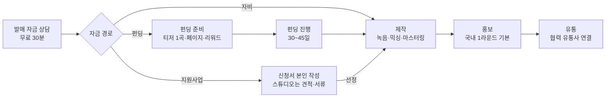

# 발매 파이프라인 설계 — "제작비부터 만들어 발매까지 한 팀이 간다"

- 작성일: 2026-09-25
- 상태: **운영자 결정 확정(2026-09-25, §9) · 1·2·3단계 구현.** 3단계의 관리자 표시는 처음에 `internal_note`로 대신했다가, 전용 테이블 `funding_project_services`(마이그레이션 0037)로 바꿨다 — 서비스 종류(설계 대행·발매 연계)·약정 설계비·입금 확인을 관리자 심사 화면에서 기록한다.
- 근거: `docs/revenue-growth-strategy-2026-09.md` 핵심 축, 운영자 발언(2026-09-25) "펀딩 기획 등으로
  잘 해주고 있는 일이자 큰 강점, 홍보·유통까지 이어지는 단계도 마찬가지, 유통은 협력사 연결".

## 1. 문제 — 강점이 사이트에서 조각나 있다

펀딩 → 제작 → 홍보 → 유통을 한 팀이 끝까지 가는 것이 가장 큰 강점인데, 사이트는 이 흐름을 세 페이지의
부속품으로 흩어 놓았다. 코드·카피 실측(2026-09-25):

| 자리 | 지금 말하는 것 | 빠진 것 |
|---|---|---|
| `/release-project` 히어로 | "곡은 있는데, 막막한 분께 — 기획부터 녹음·세션·믹싱·유통, 매체까지" | **돈.** 발매를 막는 1순위 이유(연 활동수입 평균 901만원)에 답하지 않는다 |
| `/release-project` 프로세스 5단계 | A&R → 보컬 녹음 → 세션 → 믹싱·마스터링·유통 → PR | **펀딩 단계가 없다.** 펀딩은 `scope.items[5]` 한 줄, 정규 티어의 "지원사업 동행" 한 칸뿐 |
| `/release-project` 티어 | "싱글 기준 약 50만원~" | 그 돈을 어디서 마련하는지. 세션비 포함 여부도 페이지마다 다르다 |
| `/release-project` 상담 4단계 | 카톡 공유 → 30분 상담 → 견적 → 결정 | 자금 경로(자비·펀딩·지원사업)를 묻지 않는다 |
| `/crowdfunding-design` | 텀블벅 등 외부 캠페인 설계 대행 40만 + 10%, 공개 펀딩 19건 표 | 제작·홍보로 이어진다는 말. 대안 칸에 발매 프로젝트 링크 한 줄 |
| `/funding` (자체 플랫폼) | "음반 제작비를 서포터와 함께 만듭니다", 개설 신청 가능 | 발매 프로젝트와의 관계. `/crowdfunding-design`은 이걸 "별개"라고 부른다 |
| 유통 카피 | "국내외 플랫폼에 유통합니다" | 실제는 **협력 유통사 연결**(운영자 확인). 자체 유통처럼 읽힌다 |
| 증거 | 발매 디스코그래피(`/release-project`)와 펀딩 19건(`/crowdfunding-design`)이 다른 페이지에 | 같은 음반이 "펀딩으로 만들어 발매까지 간" 사례라는 연결 |

측정도 이 흐름을 못 본다. 발매 페이지 리드는 `release_hero_kakao` 클릭 월 5건 안팎이고, 그중
펀딩·지원사업 경로가 몇 건인지는 어디에도 기록되지 않는다.

## 2. 목표

1. 발매 페이지에 들어온 인디 뮤지션이 5초 안에 "제작비부터 같이 만들고, 발매까지 한 팀이 간다"를 안다.
2. 돈 반론에 페이지 안에서 숫자로 답한다 — 실제 모금액과 제작비, 수수료까지 포함한 총비용.
3. 입구는 하나 — "발매 자금 상담(무료 30분)". 상담이 자금 경로를 먼저 가른다.
4. 펀딩 상품 셋(설계 대행·자체 플랫폼·발매 프로젝트 안의 펀딩)을 한 이야기로 묶는다. 단독 페이지는 지우지 않고
   **남긴다**(단독 의뢰 수요·검색 자산).
5. 모든 주장은 검증 가능하다 — 유통은 "협력사 연결", 게재·모금 보장 없음, 성공률은 미달 건 포함.

**하지 않는 것**: 새 결제 기능, 새 플랫폼 기능, 새 페이지 신설(파편화를 늘린다), 가격 인상.

## 3. 흐름 정의 — 무엇을 파는가



자금원은 셋이고, 제작부터는 같은 흐름이다. 지원사업 경로의 법적 선(신청서 대필·성공보수·선정 할인 금지)은
전략 문서 축 C를 그대로 따른다.

### 3.1 돈의 흐름과 순서 — 이 설계의 핵심 디테일

펀딩 경로는 "펀딩이 끝나야 제작비가 생긴다". 그런데 펀딩 페이지에는 들을 수 있는 음악이 있어야 모인다.
그래서 **티저 1곡을 먼저 만들고, 그 곡으로 펀딩을 열고, 모금액으로 나머지를 만든다.**

| 단계 | 기간 | 스튜디오 일 | 비용이 나오는 곳 |
|---|---|---|---|
| 0 상담 | 30분 | 자금 경로·목표액 초안 | 무료 |
| 1 펀딩 준비 | 2~4주 | 티저 1곡 녹음·믹싱, 스토리·리워드·페이지 | 설계비 + 티저 제작비(아티스트 선불) |
| 2 펀딩 진행 | 30~45일 | 소식 발행 지원, 중간 점검 | 없음 |
| 3 정산 뒤 제작 | 6~12주 | 나머지 곡 녹음·믹싱·마스터링 | 모금액 |
| 4 홍보 | 1~3주 | 보도자료·매체 발송·리포트 | 모금액(번들 포함) |
| 5 유통·리워드 | 발매일 | 협력 유통사 등록, 음원 리워드 발송 | 유통사 정책(스튜디오 중간 수수료 없음 — §9-4 확인) |

- 티저 곡은 버려지지 않는다 — 번들의 첫 곡이 된다. 선불한 티저 제작비는 번들 금액에서 차감한다.
- **플랫폼마다 미달 규칙이 다르다.** 텀블벅은 목표 미달이면 결제가 안 된다(All-or-Nothing).
  자체 플랫폼은 Keep-it-All이라 미달이어도 모금액이 들어오지만 리워드 이행 의무도 남는다.
  상담에서 이 차이를 먼저 설명하고, 페이지 FAQ에 적는다.

### 3.2 목표액 역산 — "얼마를 모아야 하나"

아티스트가 가장 먼저 틀리는 숫자가 목표액이다. 수수료와 리워드 원가를 빼먹고 제작비만 목표로 잡으면,
달성해도 제작비가 모자란다. 목표액은 거꾸로 계산한다.

```latex
\text{목표액} = \frac{\text{제작비} + \text{리워드 원가} + \text{설계비}}{1 - (\text{플랫폼·결제 수수료율} + \text{성공 수수료율})}
```

EP 번들 기준 예시(리워드 원가 150만원 가정, 텀블벅 8.8% + 성공 수수료 10%):
(180 + 150 + 40) / (1 − 0.188) ≈ **456만원**. 공개 음반 펀딩 최근 7건의 중앙값(약 810만원)보다 낮다 —
"이 규모면 펀딩으로 충분히 된다"를 숫자로 보여 줄 수 있다. 반대로 목표가 300만원대로 떨어지면 수수료 비중이
커지므로, 그 구간은 셀프 가이드를 권한다(§9-6).

값은 전부 상수에서 온다 — 번들가는 `data/pricing.ts`, 수수료는 `FUNDING_*_PERCENT`, 모금 통계는
`data/crowdfundingCases.ts`에서 계산한다. 페이지에 리터럴을 박지 않는다(`data/pricing.test.ts` 리터럴 스캔).

## 4. 정보 구조 — 새 페이지를 만들지 않고 연결을 바꾼다

| 페이지 | 역할(바뀐 뒤) | 변경 |
|---|---|---|
| `/ko/release-project` | **파이프라인의 정문.** 돈 → 제작 → 홍보 → 유통 전체 | 히어로 부제·프로세스·새 "제작비" 절·사례·상담 (§5) |
| `/ko/crowdfunding-design` | 펀딩만 따로 맡기려는 사람의 문. 검색 "텀블벅 대행" 수신 | 상단에 "제작·홍보까지 이어 가려면 → 발매 프로젝트" 한 줄 승격, 사례 표에 "발매까지" 배지 |
| `/ko/funding` | 모금이 실제로 일어나는 곳(자체 플랫폼) | 빈 목록일 때 "펀딩으로 발매 준비 중이라면 → 발매 자금 상담" 안내 |
| `/ko/music-promotion` | 홍보만 맡기려는 사람의 문 | 변경 없음(파이프라인에선 번들 포함) |
| 헤더 "발매" 그룹 | 발매 프로젝트 · 음원 발매 홍보 · 펀딩 설계 대행 | 순서 유지. 라벨 "발매 프로젝트" 옆 설명문 "제작비부터 유통까지"(드롭다운 보조문이 있으면) |

비-ko 로케일: 펀딩은 ko 전용 상품이라(`lib/koOnlyRoutes.ts`) 발매 페이지의 제작비 절·계산기·사례는
**ko에서만 렌더**한다. 비-ko는 지금 구성을 유지한다 — 유통 문구 정정(§5-4)만 7개 로케일 공통.

## 5. `/ko/release-project` 개편안 (위에서 아래 순서)

1. **히어로** — h1은 그대로 둔다(바꾸면 히어로 폰트 서브셋 재생성 필요, CLAUDE.md). 부제만 바꾼다:
   "제작비를 만드는 펀딩부터 녹음·믹싱, 매체 홍보, 유통까지. 발매의 모든 단계를 한 팀이 끝까지 함께합니다."
   1차 CTA 문구 "카카오톡으로 1분 상담" → **"발매 자금 상담 (무료 30분)"**. 목적지는 그대로 카톡.
2. **신규: "제작비, 이렇게 만듭니다"** (ko 전용) — 세 갈래 카드: 펀딩 / 지원사업 / 자비.
   펀딩 카드에 숫자 두 개: "공개 음반 펀딩 최근 7건 모금 중앙값 약 810만원" · "EP 번들 180만원".
   각 카드에서 해당 경로 설명과 링크(펀딩 → `/ko/crowdfunding-design`, 지원사업 → 제작처 페이지가 생기면 그리로).
3. **신규: 목표액 계산기** (ko 전용, 2단계) — 곡 수(싱글/EP/정규) · 리워드(음원만/CD 포함) · 플랫폼(텀블벅/스튜디오 놀 펀딩)
   → 목표액 역산 결과 + 내역. 결과 아래 "이 계산 결과로 상담받기" = 요약 텍스트 복사 후 카톡 열기(카톡과 경쟁하지 않는다).
4. **프로세스 5단계 → 6단계**: "제작비 마련(펀딩·지원사업)"을 1단계로 추가.
   "믹싱·마스터링·유통"의 유통 문구는 "협력 유통사를 통해 멜론·스포티파이·애플뮤직 등에 발매 등록"으로.
5. **신규: "펀딩으로 시작해 발매까지 간 음반"** (ko 전용) — 사례 카드 3~4장. 카드 = 모금액·후원자 수(플랫폼 링크) +
   스튜디오가 한 일(프로듀싱·믹싱·홍보) + 발매 링크(멜론/스포티파이). 후보: 〈이름을 모르는 먼 곳의 그대에게〉,
   〈강호중〉, 〈엉아들〉, 마리코 & 유키에 《남산타워》 — **§9-3 운영자 확인 전엔 싣지 않는다.**
   데이터는 `data/crowdfundingCases.ts`에 `pipeline?: { produced; mixed; promoted }` 필드를 더해 한 곳에서 관리.
6. **티어 표** — 가격 문구는 그대로(로케일 티어 가드가 숫자를 파싱한다). 표 아래 주석 한 줄 추가:
   "세션·아트워크는 실비 + 섭외 수수료로 별도 견적 · 펀딩 경로면 제작비는 모금액에서 집행".
   세션 포함 여부가 페이지마다 다른 것(`tiers.single.detail` "세션 1~2인 포함" vs 정본 없음)을 이때 한쪽으로 맞춘다(§9-2).
7. **상담 4단계** — 1단계 문구에 "제작비는 어떻게 마련할 생각인지(펀딩·지원사업·자비·모름)"를 적어 달라는 요청 추가.
8. **FAQ 추가 3문항** (ko): 펀딩이 목표에 못 미치면? / 펀딩은 텀블벅과 스튜디오 놀 펀딩 중 어디서? /
   지원사업에 선정되면 꼭 여기서 제작해야 하나?(아니다 — 축 C 서면 원칙)

## 6. 측정

- **cta_id 신설**: `release_funding_consult`(히어로·제작비 절·계산기 결과), 계산기 사용은 `micro_pipeline_calc`(리드 아님).
  리드 이벤트명(`lead_click_kakao`)은 그대로 — 기준선 유지.
- **자금 경로 기록**: 리드 시트(전략 문서 "지금 바로 할 5가지" 2번)에 `funding_path` 열(펀딩·지원사업·자비·모름) 추가.
  파이프라인의 진짜 KPI는 "펀딩 경로 상담 → 계약" 건수이고, 이건 GA4가 아니라 시트에서만 나온다.
- **판정**: `/ko/release-project`는 열린 실험이 없다. 개편일을 `docs/ctr-surgery-log.md`에 전환 실험으로 등재하고,
  `scripts/lead-verdict.mjs`(랜딩 기준 세션당 리드)로 8주 뒤 판정. 대조군은 `/ko/music-promotion`.
  단, 월 리드가 5건 안팎이라 GA4 판정은 약하다 — 시트의 계약 건수를 1차 지표로 둔다.

## 7. 단계별 구현

| 단계 | 범위 | 코드 규모 | 선행 조건 |
|---|---|---|---|
| **1** 카피·구조 | §5-1 부제·CTA 문구, §5-2 제작비 절(정적), §5-4 프로세스 6단계·유통 정정, §5-7 상담 문구, §5-8 FAQ, `/crowdfunding-design` 상단 연결 한 줄, `/funding` 빈 목록 안내 | 페이지 1 + 컴포넌트 1 + 로케일 키 | 없음(§9 기본값으로 진행 가능) |
| **2** 계산기·사례 | §5-3 목표액 계산기, §5-5 사례 카드, `crowdfundingCases.ts` pipeline 필드, cta_id | 컴포넌트 2 + 테스트 | §9-1·3·6 결정 |
| **3** 플랫폼 연결 | `/ko/funding` 목록 아래 세 갈래(직접 개설·설계 대행·발매 프로젝트), `/ko/funding/apply`에 "혼자 쓰기 막막하다면" 안내, 사례 카드에 남산타워 발매기 스토리 연결. 설계 대행·발매 연계 표시는 관리자 전용 테이블 `funding_project_services`(0037, 약정 설계비·입금 확인 포함) | 소 | 완료(2026-09-26) |

1단계 완료 게이트: `tsc` · `lint` · `jest` 전체 · `check:facts` · `check:cta-routing` · `generate-hero-font --check` ·
`next build`(로컬은 `--max-old-space-size`) · 상업 LP 변경이므로 배포 뒤 GSC 색인 요청.

## 8. 위험과 가드

| 위험 | 가드 |
|---|---|
| "펀딩하면 제작비가 생긴다"가 보장처럼 읽힘 | "모금은 보장하지 않는다" 명시. 사례는 미달 건 포함 여부를 운영자가 정한 뒤(§9-5) 성공률은 쓰지 않거나 미달 포함으로만 |
| 유통을 자체 유통으로 오인 | "협력 유통사 연결" 문구 7개 로케일 공통 적용 |
| 수수료 겹침(설계 + 성공 + 플랫폼)이 소형 펀딩에서 32%까지 | 계산기가 먼저 보여 준다. 파이프라인 계약 시 수수료 조정(§9-2) |
| 지원사업 경로의 이해충돌 | 축 C 원칙(본인 작성·공급자 서류만·선정 할인 금지)을 FAQ와 상담 문구에 그대로 |
| 비-ko에 펀딩이 새어 나감 | ko 전용 렌더 + `lib/koOnlyRoutes.test.ts` 계열 테스트 1개 추가 |
| 모금 통계 리터럴 드리프트 | 중앙값·건수는 `crowdfundingCases.ts`에서 계산하는 함수 하나로. 리터럴 금지 |

## 9. 운영자 결정 (2026-09-25 확정)

| # | 질문 | 결정 | 반영 |
|---|---|---|---|
| 1 | 파이프라인 펀딩은 어느 플랫폼에서? | **스튜디오 놀 펀딩에서 무조건 연다** | 발매 페이지·펀딩 설계 대행 페이지·llms 모두 "스튜디오 놀 펀딩". 텀블벅은 과거 실적 표기에만 남는다 |
| 2 | 수수료 구조 | **성공 수수료 없음. 설계비 50만원(부가세 별도) + 모금액에서 플랫폼 5.5%·결제 3.3%(부가세 포함)** | 파이프라인만이 아니라 펀딩 설계 대행 상품 자체의 구조. `FUNDING_DESIGN_PRICE` 400,000 → 500,000, `FUNDING_SUCCESS_FEE_PERCENT` 삭제 |
| 3 | 사례 카드 음반 | 〈이름을 모르는 먼 곳의 그대에게〉·〈강호중〉·〈엉아들〉·《남산타워》 — **기획·제작·음향 전부 스튜디오** | `data/crowdfundingCases.ts`의 `release.portfolioId` |
| 4 | 협력 유통사 | **여러 곳 — 음반마다 고객과 상의해 가장 맞는 곳을 정한다** | 이름·수수료는 적지 않는다. "스튜디오 중간 수수료 없음" 주장도 쓰지 않는다 |
| 5 | 목표 미달 펀딩 | **싣지 않는다** | 통계·사례는 성공 건만. 성공률 숫자는 쓰지 않는다 |
| 6 | 소형 펀딩 | **별도 취급 없이 똑같이 간다** | §3.2의 "300만원대는 셀프 가이드 권유"는 폐기 |

§3.2의 목표액 식도 성공 수수료가 빠져 이렇게 바뀐다(개인 개설자는 원천징수 3.3%까지):

```latex
\text{목표액} = \frac{\text{제작비}\times1.1 + \text{설계비}\times1.1 + \text{리워드 원가·기타}}{(1-0.088)\times(1-0.033)}
```

구현은 `lib/funding/goal.ts`(순수 함수)이고, `lib/funding/goal.test.ts`가 정산 정본
`computeFundingPayout`과 원 단위로 대조한다.
